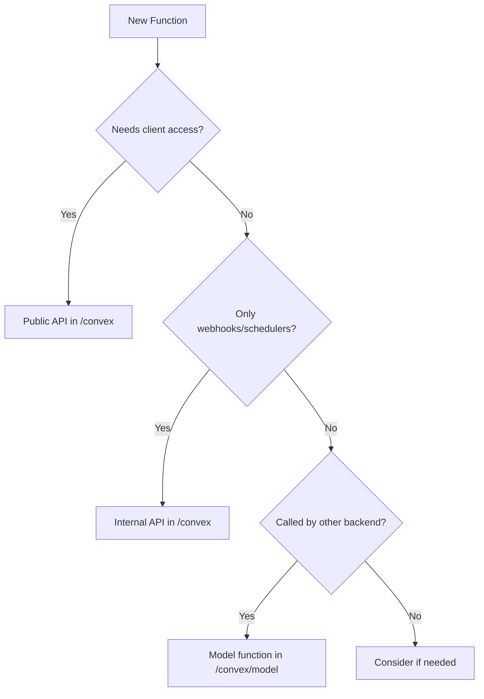

# Convex Architecture Patterns: API vs Implementation Separation

## The Fundamental Shift in Convex 1.21+

This document outlines a **critical architectural pattern** that emerged from Convex 1.21 onwards. Understanding this pattern is essential for building secure, maintainable, and scalable Convex applications.

## Executive Summary

**Key Principle**: Separate your API layer from your business logic implementation.

- `/convex` directory = **Public API endpoints** (what clients can call)
- `/convex/model` directory = **Business logic** (internal implementation)
- Never call Convex functions directly from other Convex functions
- Always extract shared logic into model functions

## The Problem: Why This Changed

### Before Convex 1.21
Developers commonly called Convex functions directly from other Convex functions:

```javascript
// ❌ OLD ANTI-PATTERN - This now throws type errors
export const getPost = query({
  handler: async (ctx, { postId }) => {
    return await ctx.db.get(postId);
  }
});

export const getPostWithAuthor = query({
  handler: async (ctx, { postId }) => {
    // PROBLEM: Directly calling another query
    const post = await getPost(ctx, { postId });
    const author = await getAuthor(ctx, { authorId: post.authorId });
    return { post, author };
  }
});
```

### Why This Is Problematic

When you wrap a function in `query()` or `mutation()`, Convex:
1. **Validates arguments** against the schema
2. **Runs it as a transaction** with isolation guarantees
3. **Applies security rules** and rate limiting
4. **Tracks it for monitoring** and debugging

**Direct function calls bypass ALL these safeguards!**

## The Solution: Model/API Separation

### Directory Structure
```
convex/
├── _generated/           # Convex generated files
├── model/               # Business logic layer
│   ├── users.js         # User-related business logic
│   ├── posts.js         # Post-related business logic
│   └── auth.js          # Authentication logic
├── users.js             # User API endpoints
├── posts.js             # Post API endpoints
└── auth.js              # Auth API endpoints
```

### Implementation Pattern

#### Step 1: Create Model Functions (Business Logic)
```javascript
// convex/model/posts.js
export async function getPostById(ctx, postId) {
  const post = await ctx.db.get(postId);
  if (!post) return null;
  
  // Add view count
  await ctx.db.patch(postId, {
    views: (post.views || 0) + 1
  });
  
  return post;
}

export async function getPostWithAuthorData(ctx, postId) {
  const post = await getPostById(ctx, postId);
  if (!post) return null;
  
  const author = await ctx.db.get(post.authorId);
  return { post, author };
}

export async function createPost(ctx, { title, content, authorId }) {
  // Validation logic
  if (!title || title.length < 5) {
    throw new Error("Title must be at least 5 characters");
  }
  
  // Business rules
  const author = await ctx.db.get(authorId);
  if (!author.canPost) {
    throw new Error("User doesn't have posting privileges");
  }
  
  // Create post
  return await ctx.db.insert("posts", {
    title,
    content,
    authorId,
    createdAt: Date.now(),
    views: 0,
    status: "published"
  });
}
```

#### Step 2: Create API Endpoints
```javascript
// convex/posts.js
import { v } from "convex/values";
import { query, mutation } from "./_generated/server";
import { 
  getPostById, 
  getPostWithAuthorData, 
  createPost 
} from "./model/posts";

// Simple API endpoint
export const getPost = query({
  args: { postId: v.id("posts") },
  handler: async (ctx, { postId }) => {
    return await getPostById(ctx, postId);
  }
});

// Composed API endpoint
export const getPostWithAuthor = query({
  args: { postId: v.id("posts") },
  handler: async (ctx, { postId }) => {
    return await getPostWithAuthorData(ctx, postId);
  }
});

// Mutation endpoint
export const create = mutation({
  args: {
    title: v.string(),
    content: v.string(),
    authorId: v.id("users")
  },
  handler: async (ctx, args) => {
    return await createPost(ctx, args);
  }
});
```

## Decision Framework: Where Should Code Live?

Use this decision tree to determine where your function should be placed:



### Quick Reference
| Function Type | Location | Example |
|--------------|----------|---------|
| Client-facing API | `/convex/*.js` | `getPost`, `createUser` |
| Webhook handlers | `/convex/*.js` | `handleStripeWebhook` |
| Scheduled functions | `/convex/*.js` | `dailyCleanup` |
| Business logic | `/convex/model/*.js` | `calculateDiscount`, `validateUser` |
| Shared utilities | `/convex/model/*.js` | `formatDate`, `hashPassword` |

## Important Clarifications

### Understanding Export Types

A common confusion: **What exactly is exposed to the frontend?**

```javascript
// convex/model/posts.js
// ✅ This is EXPORTED but NOT EXPOSED to frontend
export async function getPostById(ctx, postId) {
  return await ctx.db.get(postId);
}

// convex/posts.js
// ✅ This is EXPORTED AND EXPOSED to frontend
export const getPost = query({
  args: { postId: v.id("posts") },
  handler: async (ctx, { postId }) => {
    return await getPostById(ctx, postId);
  }
});
```

**The key difference:**
- **Regular exported function** (`export async function`) = Can be imported by OTHER backend files only
- **Convex-wrapped export** (`export const x = query/mutation/action`) = Exposed to frontend via the API

The `/model` functions are just regular JavaScript exports - they CANNOT be called from the frontend because they're not wrapped in Convex's special functions.

### Naming Conventions and Extraction Strategies

There's active community debate about naming and when to extract logic:

#### Option A: Different Names (Clearer Intent)
```javascript
// convex/model/posts.js
export async function fetchPostWithRelations(ctx, postId) {
  // Business logic
}

// convex/posts.js  
export const getPost = query({
  handler: async (ctx, { postId }) => {
    return await fetchPostWithRelations(ctx, postId);
  }
});
```

#### Option B: Same Names (Documentation Pattern)
```javascript
// convex/model/posts.js
export async function getPost(ctx, postId) {
  // Business logic
}

// convex/posts.js
import { getPost as getPostLogic } from "./model/posts";

export const getPost = query({
  handler: async (ctx, { postId }) => {
    return await getPostLogic(ctx, postId);
  }
});
```

#### Option C: Minimal Extraction (Pragmatic Approach)
```javascript
// convex/model/shared.js
export async function enrichPostData(ctx, post) {
  // Only the reusable parts
}

// convex/posts.js
export const getPost = query({
  handler: async (ctx, { postId }) => {
    const post = await ctx.db.get(postId);
    return await enrichPostData(ctx, post);  // Only shared logic extracted
  }
});
```

### The Real-World Approach

**You don't need to extract EVERYTHING.** Here's a pragmatic decision framework:

```javascript
// convex/posts.js
// ✅ Simple queries might not need extraction
export const getPostById = query({
  args: { postId: v.id("posts") },
  handler: async (ctx, { postId }) => {
    return await ctx.db.get(postId);  // So simple, why extract?
  }
});

// ✅ Complex queries benefit from extraction
export const getPostWithEverything = query({
  args: { postId: v.id("posts") },
  handler: async (ctx, { postId }) => {
    // This calls a model function because it's complex
    return await fetchCompletePostData(ctx, postId);
  }
});

// convex/model/posts.js
// Only extract complex, reusable logic
export async function fetchCompletePostData(ctx, postId) {
  const post = await ctx.db.get(postId);
  const comments = await getManyFrom(ctx, "comments", "postId", postId);
  const categories = await getManyVia(
    ctx, "postCategories", "categoryId", postId, "postId", "posts"
  );
  // ... 50+ lines of complex logic
  return { post, comments, categories };
}
```

### When to Extract Logic to Model Layer

**Extract when:**
1. **Logic is reused** across multiple endpoints
2. **Logic is complex** (>10-15 lines)
3. **You need to call it** from another backend function
4. **Testing in isolation** would be valuable
5. **Business rules** are involved (not just data fetching)

**Don't extract when:**
1. It's a **simple one-liner** database query
2. The logic is **specific to one endpoint**
3. It would create **unnecessary abstraction**
4. The function is **purely presentational** formatting

### Recommended Naming Patterns

Use descriptive names that indicate the layer's purpose:

**API Layer** (user-facing names):
- `getPost`, `createPost`, `updatePost`, `deletePost`
- `listPosts`, `searchPosts`, `getMyPosts`

**Model Layer** (implementation-focused names):
- `fetchPostData`, `enrichPostWithRelations`
- `validatePostOwnership`, `checkPostPermissions`
- `calculatePostScore`, `aggregatePostMetrics`
- `buildPostQuery`, `formatPostForExport`

### Progressive Migration Strategy

If you have an existing codebase, don't refactor everything at once:

```javascript
// Step 1: Identify functions that call other Convex functions
// Step 2: Extract only the shared logic first
// Step 3: Gradually move complex logic to model layer
// Step 4: Keep simple queries as-is

// Before (causes type errors in 1.21+)
export const complexQuery = query({
  handler: async (ctx, args) => {
    const result1 = await simpleQuery(ctx, { id: args.id });  // ❌
    const result2 = await anotherQuery(ctx, { data: result1 }); // ❌
    return process(result1, result2);
  }
});

// After (minimal refactor)
export const complexQuery = query({
  handler: async (ctx, args) => {
    // Only extract the actual logic, not the entire query
    const result1 = await ctx.db.get(args.id);  // Inline simple logic
    const result2 = await processComplexLogic(ctx, result1); // Extract complex logic
    return process(result1, result2);
  }
});
```

### Summary of Clarifications

1. **Export ≠ Frontend Exposure**: Only `query()`, `mutation()`, and `action()` wrapped functions are exposed to frontend
2. **Naming is flexible**: Choose what makes sense for your team
3. **Extract strategically**: Not everything needs to be in the model layer
4. **Start simple**: Refactor as complexity grows
5. **The pattern is about capability, not mandate**: Use it where it adds value

## Advanced Patterns

### Pattern 1: Composition with Relationship Helpers

```javascript
// convex/model/posts.js
import { getManyFrom, getManyVia } from "convex-helpers/server/relationships";

export async function getCompletePost(ctx, postId) {
  const post = await ctx.db.get(postId);
  if (!post) return null;
  
  // Use relationship helpers in model layer
  const comments = await getManyFrom(ctx, "comments", "postId", postId);
  const tags = await getManyVia(
    ctx, "postTags", "postId", postId, "tagId", "tags"
  );
  
  // Fetch comment authors efficiently
  const authorIds = [...new Set(comments.map(c => c.authorId))];
  const authors = await Promise.all(
    authorIds.map(id => ctx.db.get(id))
  );
  
  const authorMap = Object.fromEntries(
    authors.map(a => [a._id, a])
  );
  
  return {
    ...post,
    comments: comments.map(c => ({
      ...c,
      author: authorMap[c.authorId]
    })),
    tags
  };
}

// convex/posts.js
export const getFullPost = query({
  args: { postId: v.id("posts") },
  handler: async (ctx, { postId }) => {
    return await getCompletePost(ctx, postId);
  }
});
```

### Pattern 2: Transaction Boundaries

```javascript
// convex/model/orders.js
export async function processOrder(ctx, orderId) {
  const order = await ctx.db.get(orderId);
  
  // All these operations happen in one transaction
  await updateInventory(ctx, order.items);
  await chargePayment(ctx, order.paymentMethod, order.total);
  await sendOrderConfirmation(ctx, order.userId, orderId);
  
  await ctx.db.patch(orderId, { status: "processed" });
  return order;
}

// Helper functions - same transaction context
async function updateInventory(ctx, items) {
  for (const item of items) {
    const product = await ctx.db.get(item.productId);
    await ctx.db.patch(item.productId, {
      inventory: product.inventory - item.quantity
    });
  }
}

async function chargePayment(ctx, paymentMethod, amount) {
  // Payment logic
}

async function sendOrderConfirmation(ctx, userId, orderId) {
  // Email logic
}

// convex/orders.js
export const process = mutation({
  args: { orderId: v.id("orders") },
  handler: async (ctx, { orderId }) => {
    // Single transaction boundary
    return await processOrder(ctx, orderId);
  }
});
```

### Pattern 3: Access Control in Model Layer

```javascript
// convex/model/auth.js
export async function getCurrentUser(ctx) {
  const identity = await ctx.auth.getUserIdentity();
  if (!identity) return null;
  
  return await ctx.db
    .query("users")
    .withIndex("by_token", q => 
      q.eq("tokenIdentifier", identity.tokenIdentifier)
    )
    .unique();
}

export async function requireUser(ctx) {
  const user = await getCurrentUser(ctx);
  if (!user) {
    throw new Error("Authentication required");
  }
  return user;
}

export async function requireAdmin(ctx) {
  const user = await requireUser(ctx);
  if (!user.isAdmin) {
    throw new Error("Admin access required");
  }
  return user;
}

// convex/model/posts.js
import { requireUser, requireAdmin } from "./auth";

export async function createPost(ctx, data) {
  const user = await requireUser(ctx);
  
  return await ctx.db.insert("posts", {
    ...data,
    authorId: user._id,
    createdAt: Date.now()
  });
}

export async function deletePost(ctx, postId) {
  const user = await requireUser(ctx);
  const post = await ctx.db.get(postId);
  
  // Only author or admin can delete
  if (post.authorId !== user._id) {
    await requireAdmin(ctx);
  }
  
  await ctx.db.delete(postId);
}
```

## Testing Strategy

### Testing Model Functions

```javascript
// tests/model/posts.test.js
import { convexTest } from "convex-test";
import { getCompletePost, createPost } from "../convex/model/posts";

describe("Post Model", () => {
  let t;
  
  beforeEach(() => {
    t = convexTest();
  });
  
  test("getCompletePost returns post with relations", async () => {
    // Setup test data
    const authorId = await t.run(async (ctx) => {
      return await ctx.db.insert("users", { name: "Test Author" });
    });
    
    const postId = await t.run(async (ctx) => {
      return await ctx.db.insert("posts", {
        title: "Test Post",
        authorId,
        content: "Content"
      });
    });
    
    // Test the model function
    const result = await t.run(async (ctx) => {
      return await getCompletePost(ctx, postId);
    });
    
    expect(result).toBeDefined();
    expect(result.title).toBe("Test Post");
    expect(result.comments).toBeArray();
  });
  
  test("createPost validates input", async () => {
    await expect(
      t.run(async (ctx) => {
        return await createPost(ctx, { title: "Hi" }); // Too short
      })
    ).rejects.toThrow("Title must be at least 5 characters");
  });
});
```

### Testing API Endpoints (Optional)

```javascript
// tests/api/posts.test.js
import { convexTest } from "convex-test";
import { api } from "../convex/_generated/api";

describe("Post API", () => {
  let t;
  
  beforeEach(() => {
    t = convexTest();
  });
  
  test("getPost validates ID argument", async () => {
    await expect(
      t.query(api.posts.getPost, { postId: "invalid" })
    ).rejects.toThrow("Argument Validation Error");
  });
  
  test("create mutation requires all fields", async () => {
    await expect(
      t.mutation(api.posts.create, { title: "Test" })
    ).rejects.toThrow("missing required field");
  });
});
```

## Benefits of This Architecture

### 1. Security
- Clear boundary between public API and internal logic
- Arguments are always validated at API boundary
- Access control is centralized in model layer

### 2. Performance
- Model functions can be composed without transaction overhead
- No unnecessary argument validation between internal calls
- Better query optimization opportunities

### 3. Maintainability
- Change implementation without breaking API contracts
- Business logic is centralized and reusable
- Clear separation of concerns

### 4. Testability
- Test business logic without API complexity
- Mock dependencies easily
- Unit test model functions in isolation

### 5. Type Safety
- Each layer has appropriate typing
- TypeScript can better infer types
- Reduced type casting needed

## Migration Guide

### Step 1: Identify Direct Function Calls
Search for patterns like:
```javascript
// Look for these patterns
await someQuery(ctx, args)
await someMutation(ctx, args)
```

### Step 2: Extract to Model Functions
1. Create `/convex/model` directory
2. Move business logic to model files
3. Keep only thin wrappers in API files

### Step 3: Update Imports
```javascript
// Before
import { getUser } from "./users";

// After
import { getUserById } from "./model/users";
```

### Step 4: Test Thoroughly
- Test model functions directly
- Verify API endpoints still work
- Check that validations are applied

## Common Pitfalls to Avoid

### ❌ Don't: Mix API and Model in Same File
```javascript
// Bad: Mixing concerns
// convex/posts.js
export async function getPostLogic(ctx, postId) { /*...*/ }

export const getPost = query({
  handler: async (ctx, { postId }) => {
    return await getPostLogic(ctx, postId);
  }
});
```

### ✅ Do: Separate Files for Clarity
```javascript
// Good: Clear separation
// convex/model/posts.js
export async function getPostById(ctx, postId) { /*...*/ }

// convex/posts.js
import { getPostById } from "./model/posts";
```

### ❌ Don't: Duplicate Validation
```javascript
// Bad: Validation in both layers
// convex/model/posts.js
export async function createPost(ctx, data) {
  if (!data.title) throw new Error("Title required");
  // ...
}

// convex/posts.js
export const create = mutation({
  args: { title: v.string() }, // Also validates here
  handler: async (ctx, args) => {
    if (!args.title) throw new Error("Title required"); // Duplicate!
    return await createPost(ctx, args);
  }
});
```

### ✅ Do: Validate Once at Boundary
```javascript
// Good: Single validation point
// convex/posts.js
export const create = mutation({
  args: { 
    title: v.string(),
    content: v.string()
  },
  handler: async (ctx, args) => {
    // Args already validated by Convex
    return await createPost(ctx, args);
  }
});
```

## Conclusion

The API/Model separation pattern is not just a best practice—it's essential for building production-ready Convex applications. By following this pattern, you'll create more secure, maintainable, and testable applications that scale with your needs.

### Key Takeaways
1. Think of `/convex` as your API surface, not a collection of functions
2. Extract all business logic to `/convex/model`
3. Never call wrapped queries/mutations from other functions
4. Test your model layer thoroughly
5. Keep API endpoints thin and focused on validation

This architectural shift represents Convex's maturation as a platform, moving from rapid prototyping to production-ready applications with clear boundaries and responsibilities.